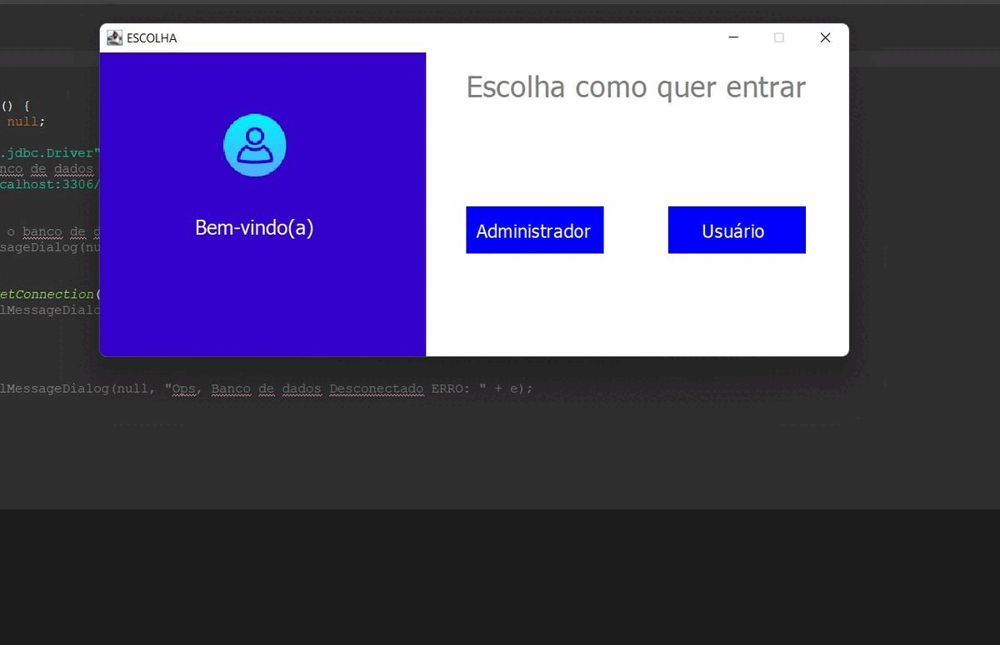

# Projeto JAVA
Aplicação feita com linguagem Java e Java Swing com um menu de programas como: calculadora de imc, calculadora padrão, calculadora de idade, tabuada, e área para entrar em contato com o administrador. Possui também  CRUD completo, e área de consulta de clientes cadastrados no sistema.

 

  
 
      
       
